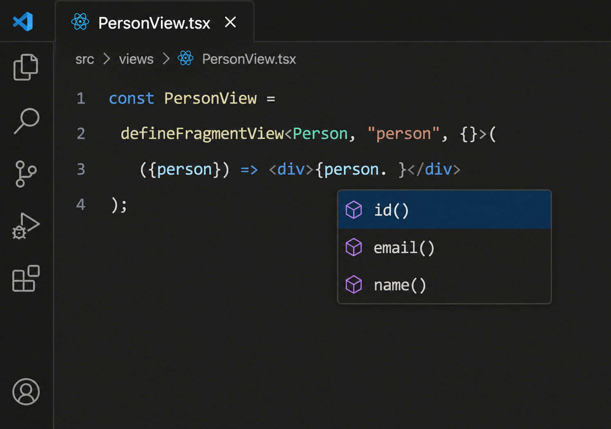

**WARNING: This is a highly-experimental library. Most of the features have not been implemented, and more importantly the approach itself has not been proven. Consequently this library may be abandoned at any time. Use at your own risk.**

# ViewQL

**Write React components directly against your GraphQL Schema types. ViewQL derives the Queries and Fragment Definitions for you.**

ViewQL is a compiler that automatically derives GraphQL operation and fragment definitions to fetch the data your React components actually use. Consider the following example component which transforms the GraphQL Person Schema Type:

```tsx
const PersonInfoByIDView =
  defineQueryView<YourSchema.Query, { id: GraphSpec.ID, showFriends: boolean }}>(
    ({ query, id, showFriends }) => {
      const node = query.node({id});
      if (node instanceof Person) {
        const person = node as Person;
        return <div>
          <div>{person.name()}</div>

          {showFriends && (
            <Defer fallback={<div>Loading friends...</div>}>
              <FriendList person={person} />
            </Defer>
          )}
        </div>
      }
      else {
        return <div>Person not found.</div>;
      }
    );
```

ViewQL analyzes this React component and automatically performs the following operations:

* Defines GraphQL queries and fragments to retrieve the necessary fields for all components.
* Conditionally `@include` the Person's friend list in the query response by promoting the showFriends prop to a GraphQL query parameter.
* `@defer` loading of Person's friends list, and suspend rendering of `<FriendsList>` component until the data is received.
* Replaces references to the Person schema type with the generated fragment types at build time


Relay is the initial supported GraphQL client. Apollo Client support is planned.

## Why ViewQL?

### Don't Repeat Yourself

Traditional colocated GraphQL still requires expressing the same dependency twice, once in the fragment and once in the code:

```tsx
const PersonView = ({ person }) => {
  const personData = useFragment(graphql`
        fragment PersonFragment on Person {
            name
        }
    `);

  return <div>{personData.name}</div>;
};
```

With ViewQL, your React component is the declaration of what it needs. You code directly against the schema and the fragment is automatically extracted:

```tsx
const PersonView = 
  defineFragmentView<Person, "person", {}>(
    ({person}) => <div>{person.name()}</div>
  );
```

 ViewQL's approach eliminates the hazard of accidental overfetching where developers request fields their components don't actually use.

### Automatically @skip or @include data

In addition to eliminating accidental overfetching in hand-written fragments, ViewQL goes further and analyzes component control flow to determine whether fields can be conditionally skipped.

For example:

```tsx
if (showFriends) {
  return <FriendList person={person} />;
}
```

If ViewQL determines that the `showFriends` value can be passed to the GraphQL operation as a parameter, ViewQL can conditionally include the field in the response to further reduce overfetching:

```graphql
... @include(if: $showFriends) {
  ...FriendList
}
```

Note the developer does not need to repeat the condition in both TypeScript and GraphQL.

### Simplify Deferred Data Loading

Today GraphQL clients require developers to repeat the same pattern when attempting to suspend the rendering of a React component until a deferred GraphQL fragment retrieved from the server. Developers must both add @defer to fragments, and then wrapping the component which renders the fragment in a `<Suspense>` component.

ViewQL provides a React `<Defer>` component which encapsulates this pattern:

```tsx
<Defer fallback={<Loading />}>
  <FriendList person={person} />
</Defer>
```

When ViewQL sees a deferred React component which renders a GraphQL fragment, ViewQL emits @defer in the fragment definition and wraps the component in a `<Suspense>` tag:

```graphql
...FriendList @defer
```

The component expresses the intended rendering behavior. ViewQL derives the corresponding GraphQL execution behavior.

### Always-on Code Completion

Coding directly against your GraphQL schema types means there's no need to wait for an intermediary build step between defining a GraphQL fragment and using it in your code.




# ViewQL Example

Consider a schema containing a `Person` interface with `Customer` and `Employee` implementations.

The application wants to:

- display the person's name;
- render customer-specific or employee-specific details;
- optionally render the person's friends;
- defer loading the friends list;
- fetch only the fields needed by each component.

## What the developer writes

```tsx
import {
  Defer,
  defineFragmentView,
  defineQueryView,
} from "@viewql/runtime";

import * as GraphQLSpec from "@viewql/spec";
import * as Schema from "./FacebookGraphQLSchema";

type PersonViewProps = {
  showFriends: boolean;
};

const CustomerView =
  defineFragmentView<
    Schema.Customer,
    "customer",
    {}
  >(({ customer }) => (
    <div>
      Customer ID: {customer.customerId()}
    </div>
  ));

const EmployeeView =
  defineFragmentView<
    Schema.Employee,
    "employee",
    {}
  >(({ employee }) => (
    <div>
      Employee ID: {employee.employeeId()}
    </div>
  ));

const FriendList =
  defineFragmentView<
    Schema.Person,
    "person",
    {}
  >(({ person }) => (
    <ul>
      {person.friends().map((friend, index) => (
        <li key={index}>
          {friend.name()}
        </li>
      ))}
    </ul>
  ));

const PersonView =
  defineFragmentView<
    Schema.Person,
    "person",
    PersonViewProps
  >(({ person, showFriends }) => {
    let details: JSX.Element | null = null;

    if (person instanceof Schema.Customer) {
      details = (
        <CustomerView customer={person} />
      );
    } else if (
      person instanceof Schema.Employee
    ) {
      details = (
        <EmployeeView employee={person} />
      );
    }

    return (
      <div>
        <div>Name: {person.name()}</div>

        {details}

        {showFriends ? (
          <Defer
            fallback={
              <div>Loading friends...</div>
            }
          >
            <FriendList person={person} />
          </Defer>
        ) : null}
      </div>
    );
  });

type PersonQueryProps = {
  id: GraphQLSpec.ID;
  showFriends: boolean;
};

const PersonQuery =
  defineQueryView<
    Schema.Query,
    PersonQueryProps
  >(({ query, id, showFriends }) => {
    const person = query.person({ id });

    if (person == null) {
      return <div>Person not found</div>;
    }

    return (
      <PersonView
        person={person}
        showFriends={showFriends}
      />
    );
  });
```

There are no GraphQL fragments, inline fragments, fragment arguments, `@include`, `@alias`, or `@defer` directives in the application source. Instead, ViewQL derives them.

# What ViewQL extracts

## Customer fragment

```graphql
fragment CustomerView on Customer {
  customerId
}
```

## Employee fragment

```graphql
fragment EmployeeView on Employee {
  employeeId
}
```

## Friends fragment

```graphql
fragment FriendList on Person {
  friends {
    name
  }
}
```

## Person fragment

```graphql
fragment PersonView on Person
@argumentDefinitions(
  showFriends: { type: "Boolean!" }
) {
  name

  ... on Customer
    @alias(as: "_viewql_customer") {
    ...CustomerView
  }

  ... on Employee
    @alias(as: "_viewql_employee") {
    ...EmployeeView
  }

  ... @include(if: $showFriends)
      @alias(as: "_viewql_showFriends") {
    ...FriendList
      @defer(label: "PersonView")
  }
}
```

Several things have been inferred from ordinary TypeScript and React code.

This:

```tsx
person instanceof Schema.Customer
```

became:

```graphql
... on Customer
```

This:

```tsx
if (showFriends)
```

became:

```graphql
@include(if: $showFriends)
```

And this:

```tsx
<Defer>
  <FriendList person={person} />
</Defer>
```

became:

```graphql
...FriendList @defer
```

Because `showFriends` ultimately controls a GraphQL selection, ViewQL also infers that it must become a fragment argument and ultimately an operation variable.

## Query

```graphql
query PersonQuery(
  $id: ID!
  $showFriends: Boolean!
) {
  person(id: $id) {
    ...PersonView
      @arguments(
        showFriends: $showFriends
      )
  }
}
```

# What the application becomes

For Relay, ViewQL rewrites the schema-level types into Relay-generated fragment models.

The exact generated types remain owned by Relay.

A leaf fragment view becomes conceptually:

```tsx
const CustomerViewFragment = graphql`
  fragment CustomerView on Customer {
    customerId
  }
`;

function CustomerView({
  customer: fragmentRef,
}: {
  customer: CustomerView$key;
}) {
  const customer = useFragment(
    CustomerViewFragment,
    fragmentRef
  );

  return (
    <div>
      Customer ID: {customer.customerId}
    </div>
  );
}
```

Likewise:

```tsx
const EmployeeViewFragment = graphql`
  fragment EmployeeView on Employee {
    employeeId
  }
`;

function EmployeeView({
  employee: fragmentRef,
}: {
  employee: EmployeeView$key;
}) {
  const employee = useFragment(
    EmployeeViewFragment,
    fragmentRef
  );

  return (
    <div>
      Employee ID: {employee.employeeId}
    </div>
  );
}
```

The friends component reads its own fragment:

```tsx
const FriendListFragment = graphql`
  fragment FriendList on Person {
    friends {
      name
    }
  }
`;

function FriendList({
  person: fragmentRef,
}: {
  person: FriendList$key;
}) {
  const person = useFragment(
    FriendListFragment,
    fragmentRef
  );

  return (
    <ul>
      {person.friends.map((friend, index) => (
        <li key={index}>
          {friend.name}
        </li>
      ))}
    </ul>
  );
}
```

Because `FriendList` is rendered beneath `<Defer>`, its `useFragment` call occurs beneath the corresponding React Suspense boundary. A deferred fragment that has not arrived can therefore suspend at the component that consumes it.

The parent fragment view becomes conceptually:

```tsx
function PersonView({
  person: fragmentRef,
  showFriends,
}: {
  person: PersonView$key;
  showFriends: boolean;
}) {
  const person = useFragment(
    PersonViewFragment,
    fragmentRef
  );

  const customer =
    person._viewql_customer;

  const employee =
    person._viewql_employee;

  const friendsRegion =
    person._viewql_showFriends;

  let details: JSX.Element | null = null;

  if (customer != null) {
    details = (
      <CustomerView customer={customer} />
    );
  } else if (employee != null) {
    details = (
      <EmployeeView employee={employee} />
    );
  }

  return (
    <div>
      <div>Name: {person.name}</div>

      {details}

      {showFriends ? (
        <Defer
          fallback={
            <div>Loading friends...</div>
          }
        >
          <FriendList
            person={friendsRegion!}
          />
        </Defer>
      ) : null}
    </div>
  );
}
```

The original:

```tsx
person instanceof Schema.Customer
```

has disappeared.

Its runtime equivalent is now:

```tsx
customer != null
```

where `customer` is the fragment model corresponding to the GraphQL type refinement.

This works with GraphQL's type system rather than JavaScript prototype inheritance and can therefore support GraphQL interfaces and compatible type refinements as well as concrete object types.

Finally, the query view becomes an ordinary Relay query component:

```tsx
function PersonQuery({
  id,
  showFriends,
}: PersonQueryProps) {
  const data =
    useLazyLoadQuery<PersonQueryType>(
      PersonQueryOperation,
      {
        id,
        showFriends,
      }
    );

  if (data.person == null) {
    return <div>Person not found</div>;
  }

  return (
    <PersonView
      person={data.person}
      showFriends={showFriends}
    />
  );
}
```

The generated schema types used while authoring the application have now been replaced by Relay's actual fragment and operation models.


# Limitations

ViewQL deliberately supports a constrained model so that GraphQL dependencies can be determined statically and safely.

## Source must be available for analyzed functions

A GraphQL object or interface value may flow through helper functions as long as ViewQL can analyze what those functions do.

For example:

```ts
function displayName(person: Schema.Person) {
  return person.name();
}
```

is analyzable.

A GraphQL value cannot be passed into opaque code for which ViewQL has neither source nor a trusted semantic definition:

```ts
someExternalLibrary.process(person);
```

ViewQL cannot determine whether that function reads fields, stores the reference, or passes it elsewhere.

Such calls produce a compiler error.

## JavaScript built-ins require trusted definitions

Functions such as:

```ts
Array.prototype.map
Array.prototype.filter
Array.prototype.reduce
```

do not normally have application source available for analysis.

ViewQL therefore maintains trusted semantic definitions for supported built-ins.

This allows common patterns such as:

```tsx
person.friends().map(friend => (
  <FriendView person={friend} />
))
```

without treating the GraphQL value as having escaped.

Unsupported built-ins or third-party helpers require either an analyzable implementation or explicit ViewQL support.

## GraphQL object and interface values cannot be stored in React state

GraphQL schema object/interface values are temporary compile-time views that become client-specific fragment models.

They are **not application state**.

This is invalid:

```tsx
const [selectedPerson, setSelectedPerson] =
  useState<Schema.Person | null>(null);

setSelectedPerson(person);
```

The same restriction applies to storing GraphQL object references inside a larger state object:

```tsx
setState({
  selectedPerson: person,
});
```

Store ordinary values instead:

```tsx
setSelectedPersonId(person.id());
```

or:

```tsx
setState({
  id: person.id(),
  name: person.name(),
});
```

Note that GraphQL scalar values may be stored in React state.

## Persistent mutable references are not GraphQL storage

The same principle applies to other long-lived mutable storage.

For example, storing a GraphQL object/interface reference in `useRef().current` is not supported:

```tsx
const selectedPerson = useRef(null);

selectedPerson.current = person;
```

Long-lived application stores, module-level caches, global variables, or similar mutable repositories should likewise contain ordinary application values rather than ViewQL GraphQL object references.

## Context may not contain GraphQL Schema Object types

Passing a GraphQL object/interface reference through arbitrary React Context would break the fragment ownership and analysis model. Instead store ID values which can be used to retrieve the Object Types on subsequent renders.

## Dynamic JavaScript can defeat static analysis

Features that make value flow impossible to determine statically may be unsupported or require conservative compiler errors.

Examples include:

```ts
any
eval(...)
dynamic reflective access
unknown proxies
unsafe type assertions
opaque native bindings
```

ViewQL favors a compile-time error over generating an operation that may under-fetch data.

## Not every runtime conditional can become a GraphQL directive

ViewQL can emit `@include` or `@skip` only when the controlling condition can be represented by GraphQL operation or fragment variables.

For example:

```tsx
if (showFriends) {
  ...
}
```

can be optimized when `showFriends` can be propagated to the operation.

A purely local condition such as...

```tsx
if (window.innerWidth > 800) {
  ...
}
```

...cannot normally be evaluated by the GraphQL server.

The React branch still works, but ViewQL may need to request the corresponding data unconditionally.

Correctness takes precedence over eliminating every unnecessary field.

## Fragment boundaries remain meaningful

A `defineFragmentView` establishes an explicit GraphQL fragment boundary.

ViewQL may introduce anonymous inline fragments internally for conditions and type refinements, but user-visible named fragments correspond to fragment views except where a client backend requires an internal implementation fragment.

This keeps GraphQL ownership aligned with React component ownership. It also ensures GraphQL Operations are semantically rich and easier to debug and understand when viewed directly.